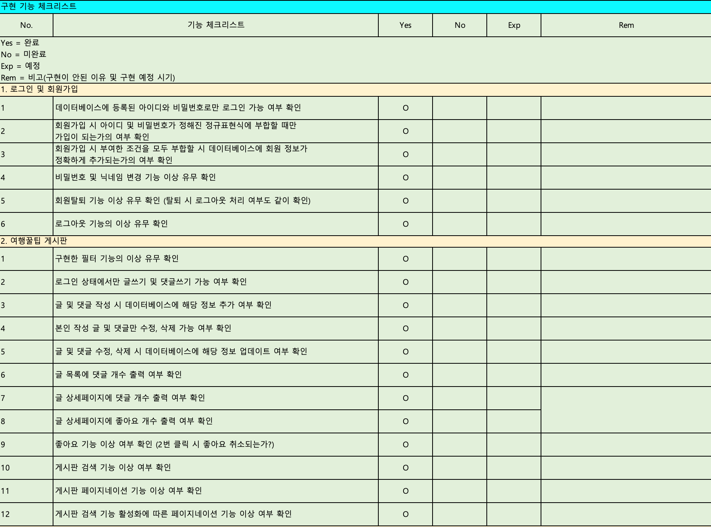

# kh4 5조  세미프로젝트  소개
**프로젝트  소개**

1. 개발  목적
	- 동적인  사이트를  만들어보기  위해
	- 여행관련  커뮤니티를  만들기  위해서
	- 취업용  포트폴리오로  활용하기  위해서
	- 프로그래밍  실력을  향상  시키기  위해서

2. 인원  구성  및  역할  분담
	- 박경일님
		해더  상단  검색기능  구현
	- 송하준님
		여행  꿀팁  기능  구현
	- 김채은님
		여행 QNA 기능  구현
	- 오혜령님
		추천  컨텐츠  메인  페이지  구현
	- 오준식님
		로그인, 회원정보, 내  정보  구현

3. 사용  도구

	- HTML, css, Javascript
	- Oracle
	- SQL developer
	- Java 8.0 version
	- Jquery
	- Tomcat Apache9
	- Servlet & JSP

4. 개발  일정

		2021년 1월 18일(월요일) ~ 1월 29일(금요일)

5. 시장  조사

	
	
**다이어그램**

1. 데이터  베이스  흐름

	

2. use-case Diagram
	
	
	
	
3. Sequence Diagram

	
	
	
4. 세부 기능 

	

**점검  체크리스트  및  수행  결과**

1. 테스트  수행  결과
	
	
	

**핵심  장면  스크린샷**

**로그인, 내정보, 회원가입 **

	

로그인파트 
-	아이디와 비밀번호로 로그인 할 수 있으며 비밀번호 찾기 기능도 구현되었다. 비밀번호 찾기는 아이디와 닉네임으로 찾아며 아이디와 닉네임이 부합할시 비밀번호가 나오는 페이지가 나오면서 5초뒤에 다시 로그인 화면으로 돌아간다 

내정보

-	내정보 파트에서는 비밀번호 변경, 닉네임 변경, 회원탈퇴를 할 수 있다. 

회원가입
- 회원가입은 정규표현식을 사용하였으며 아이디와 비밀번호가 들다 정규표현식에 만족이 되어야만 회원가입이 가능하다. 체크는 아이디확인 비밀번호확인 버튼으로 가능하다. 아래에는 체크박스도 구현하였고 체크 박스 클릭시에 아래에 이용약관에 동의하였습니다라는 글자가 나오게 구현하였다. 

회원가입 
**한계점, 보완사항  및  계획, 느낀점**

-   박경일님
    
    한계점 
	   - 경험의 부족으로 인해 시작전에 명확한 개발 설계가 되지 않아 중간에 수정을 해야하는 영역이 많아졌음 - 검색 기능을 구현하면서 조건이 많아지고, 연결된 각기 다른 테이블들의 값을 구하는 부분에 어려움이 많았음
    
    보완사항 및 계획 
    - 이번 프로젝트의 경험을 발판삼아 시간을 좀 더 잡더라도 더욱 명확하고 확실하며 꼼꼼한 개발 설계가 필요함을 느낌, 프로젝트 도중 수정사항이 발생할 때 팀원들과 명확한 커뮤니케이션을 통해 발생할 오류들을 최소화 시킬것임. 또한 프로젝트 이후에도 계속된 연습을 통해 스스로 부족한 검색구현 능력을 끌어올릴 것임. 느낀점 - 혼자 하는것이 아닌 사람들과 같이 협업을 하며 진행하는 것이기 때문에 명확한 커뮤니케이션을 해야함을 느꼈음. 또한 프로젝트 시작전에는 막연한 두려움이 있었으나 주변 많은 사람들의 도움과 스스로 찾아보고 생각하는 시간을 가지며 하나하나 실행해 봄으로써 그에 따른 시행착오를 통해 많은 부분 성장함을 느낌.
    
-   오혜령님
    
    - 계획 초반에는 메인화면에 각 게시글 데이터 출력 시 해당 게시글에 업로드 되어있는 이미지 위주의 메인화면을 구상했으나 역량 시간 부족으로 인해 이미지 위주의 디자인은 제외하였으며 이후 게시글 제목 작성일 내 용 일정 및 작성자 닉네임만으로 데이터 출력으로 변경하였다. 글 위주가 아닌 이미지 출력으로 구성을 변경한다면 가독성이 훨씬 향상 될 것이로 보인다. 프로젝트 진행은 처음 경험해 봐서 미흡한 점이 많았고 마이 너한 오류들을 해결하는 데 생각보다 시간이 많이 들어 2주면 충분하다고 생각했지만 실제 접해보니 상당히 짧게 느껴졌다. 이번 프로젝트에서는 디자인에 신경을 더 써 다음에는 프로젝트에서는 기능 구현에 더 집중 을 해야할 듯 하다.
    
-   김채은님
    
    -   이번 프로젝트에서 가장 큰 목적은 기능 실현 가능성과 팀워크라고 생각한다. 첫 프로젝트인만큼 서로 부족한 점 이해와 정확한 의견 성립이 필요했는데 부족했던 것 같다. 또한 시작전 기본 설계 자료 완성과 테이블을 미리 생성해 봤다면 도움이 됐을 것 같다.
        
    -   개인적으로 기본틀에 부족한 부분이 있어 본격적인 프로젝트 기간내 지체시간이 발생했다. 제이쿼리, 스크립트 등 기능에 대한 이해도가 낮은점, 오류 발생시 해결하는 과정에 시간이 걸리는 점을 줄여야한다.
        
    -   파이널 프로젝트 이전까지 혼자 사이트를 만들어 설계, 수정, 디자인하며 연습할 예정이다.
        
-   송하준님
    
    느낌점 
	   - 생각보다 개발시간이 많이 걸린다. 
	   -  생각보다 디자인 작업에도 많은 시간이 소요된다. 

	한계점 
	- 시간상 관리자 기능을 구현하지 못하였다. 
	 
	 보안사항 및 계획 
	 - 커뮤니티 사이트에서 관리자 기능은 중요한 기능 중 하나이므로 관리자 기능을 추가하여 보완 할 예정이다.
    
-   오준식님
    
    한계점 
    - 프로젝트를 진행하면서 오류와 실력부족의 이유로 기능을 욕심내서 많이 만들지 못하였다. 또한 프로젝트 경험 부족으로 다른 파트들의 진행사항을 신속하게 파악하지 못하였다. 

	보완사항 및 계획 
	- 여러가지 기능들 사용자가 잘 안쓰는 기능일지더라도 실력향상을 위해 다음 프로젝트에서는 많은 기능을 만들어 볼 것이고 개발자는 꾸준한 공부가 필수인 직업군으로써 앞으로도 공부를 게을리 하지않을 것이다. 

	느낀점 
	- 프로젝트는 역시 팀워크와 커뮤니케이션이 중요하다고 이번 프로젝트에서도 절실히 느꼈다. 
	-  동료들과 함께 여러가지 의견을 표출하여 프로젝트를 이끌어나가는 것이 중요하다고 느꼈다.
    
